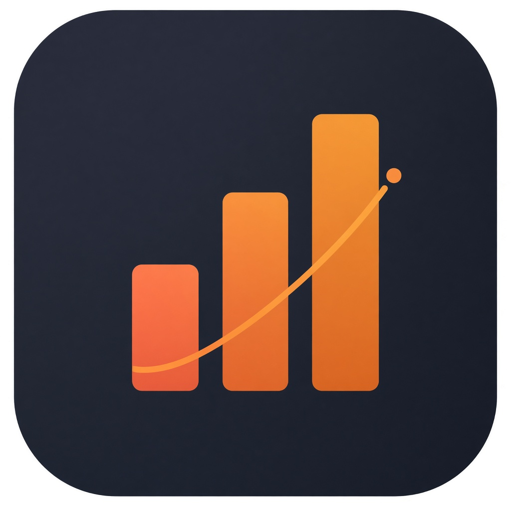

<p align="center">
  
</p>

<h1 align="center">
  <span style="display: inline-flex; align-items: center; gap: 0.4em;">
    
    Agentic Usage
  </span>
</h1>

<p align="center">
  <strong>Local observability for your coding agent harnesses.</strong> Plan leverage, project breakdown, and spend logs — in one dashboard on your machine.
</p>

<p align="center">
  <a href="https://github.com/eladdromy/agentic-usage/releases/latest"></a>
  <a href="https://github.com/eladdromy/agentic-usage/releases"></a>
  <a href="LICENSE"></a>
</p>
<p align="center">
  
  
  
  
</p>

---

## The 30-second version

Agentic Usage is a **local dashboard** that reads usage data from the coding agent tools you already run. It indexes session logs, imports billing exports where needed, and shows you **where the money went** — plan leverage by month, spend by project, and cost per request.

Everything stays on your machine. No accounts, no cloud sync, no outbound calls.

---

## What you get

| View | What it shows |
|------|----------------|
| **Plan Leverage** | Monthly API-equivalent spend ÷ subscription price — are you getting your plan's worth? |
| **Projects** | All-time spend allocated by project/workspace across harnesses |
| **Spend Logs** | Per-request token spend with filters by project, model, and date |

**Works today**

- **Claude Code** and **Cursor** in one app — merge into a combined view or switch per harness in the navbar
- First-run **setup wizard** with harness auto-detection, guided data import, and subscription approval
- Cursor **export shortcuts** during setup — suggested billing date range from local composer activity, plus one-click **Download usage** / **Open dashboard** links
- Cursor **project sync** links billing CSV rows to local workspace paths (`state.vscdb` bubble scan in the CSV date range)
- Automatic subscription plan detection where the harness exposes it
- Dynamic navbar harness control — static badge when one harness is present, or **All / Claude / Cursor** dropdown when both are installed
- Sparklines, year summaries, and downloadable leverage snapshots

**On the roadmap**

- Codex CLI, Grok Build, and additional harness adapters (see [future harness research](./docs/future-harnesses-codex-grok.md))
- One-line install (`curl … \| bash`) — dev install below for now

---

## Install

**Requirements:** Node.js 20+ and at least one supported coding agent harness with local data on disk.

```bash
git clone https://github.com/eladdromy/agentic-usage.git
cd agentic-usage
npm install
npm run dev
```

Open [http://localhost:3000](http://localhost:3000) (redirects to Plan Leverage).

Auto-open the browser after start:

```bash
npm run dev:open
```

Production build:

```bash
npm run build
npm start
```

> **Coming soon:** a single install command so you don't need to clone and run dev manually. Track progress in [Issues](https://github.com/eladdromy/agentic-usage/issues).

---

## First run

1. Start the dev server (above).
2. Open [http://localhost:3000](http://localhost:3000) — the **setup wizard** runs automatically on first launch.
3. Follow the guided steps:
   - **Claude** — auto index JSONL logs → review subscription plan
   - **Cursor** — export billing CSV (wizard suggests dates from local activity) → upload → **project sync** (blocking modal until rows are linked to workspaces) → review subscription plan
   - **Both** — Claude first, then optional Cursor (skip Cursor and finish later from the analytics banner → Settings)

The wizard blocks analytics pages until at least one harness is fully configured. Existing installs with indexed data skip the wizard automatically. See [docs/onboarding.md](./docs/onboarding.md) for step details.

After setup, Claude logs re-index on navigation; Cursor spend comes from uploaded billing CSV with project paths attached during sync. If Cursor is installed but CSV is not imported yet, a banner on every analytics page links to finish setup.

---

## Screenshots

### Plan Leverage

Monthly API-equivalent spend divided by subscription cost — with year summaries, per-harness breakdown, and downloadable snapshots.


### Spend Logs

Per-request token spend with filters by project, model, and date range.


### Projects

All-time spend allocated by project/workspace, with per-harness drill-down.


---

## Environment

| Variable | Default | Purpose |
|----------|---------|---------|
| `AGENTIC_USAGE_DATA_DIR` | `./.data` | SQLite index and app settings |
| `AGENTIC_USAGE_ANONYMIZE` | off | Replace project **display** names/paths in API responses (for README screenshots). Filter values stay real so Spend Logs project filters still work. |
| `CLAUDE_CONFIG_DIR` | `~/.claude` | Claude Code config directory (official) |
| `CLAUDE_HOME` | — | Legacy Claude config override; used only when `CLAUDE_CONFIG_DIR` is unset |
| `VSCDB_PATH` | Cursor global `state.vscdb` | Override IDE state DB path |

When `AGENTIC_USAGE_ANONYMIZE=1`, only labels shown in the UI are anonymized — not internal filter keys or database queries.

---

## README screenshots

Regenerate demo images (builds a production server with anonymization, scans APIs and rendered pages for leaks, then captures four PNGs):

```bash
npm run screenshots
```

Use an existing dev server only if it was started with anonymization enabled:

```bash
AGENTIC_USAGE_ANONYMIZE=1 npm run dev
SCREENSHOT_USE_DEV=1 npm run screenshots
```

If the dev server is not anonymized, the script exits unless you pass `SCREENSHOT_FORCE_DEV=1` (not recommended).

Verify leak checks against a running server:

```bash
SCREENSHOT_BASE_URL=http://localhost:3001 npm run screenshots:verify
```

See [docs/readme-screenshots.md](./docs/readme-screenshots.md) for details.

## Privacy

- All data stays local — SQLite indexes and settings under `.data/`
- No authentication layer (localhost tool)
- No analytics or telemetry

---

## Docs

Detailed architecture, CSV import, log parsing, and plan pricing: [docs/README.md](./docs/README.md).

---

## Dev utilities

| Command | Purpose |
|---------|---------|
| `npm run reset:cursor` | Wipe Cursor billing DB, bubble index, and Cursor onboarding flags (restart dev server after) |
| `npm run reset:claude` | Wipe Claude usage index and Claude onboarding flags |

See [cursor-project-sync-troubleshooting.md](./docs/cursor-project-sync-troubleshooting.md) if project sync shows thousands of pending rows or mass match failures.

---

## Roadmap

- [ ] Codex CLI harness adapter
- [ ] Grok Build harness adapter
- [ ] One-line installer script

Issues and PRs welcome once the repo is public.

---

## License

**PolyForm Noncommercial 1.0.0** — see [LICENSE](./LICENSE).

| Use case | Allowed? |
|----------|----------|
| Personal / hobby / research / education | Yes |
| Noncommercial organizations | Yes |
| Commercial use | Requires a separate license — [open an issue](https://github.com/eladdromy/agentic-usage/issues) |

---

<p align="center">
  Created by <a href="https://www.linkedin.com/in/elad-dromy-73769918a/">Elad Dromy</a>
</p>
