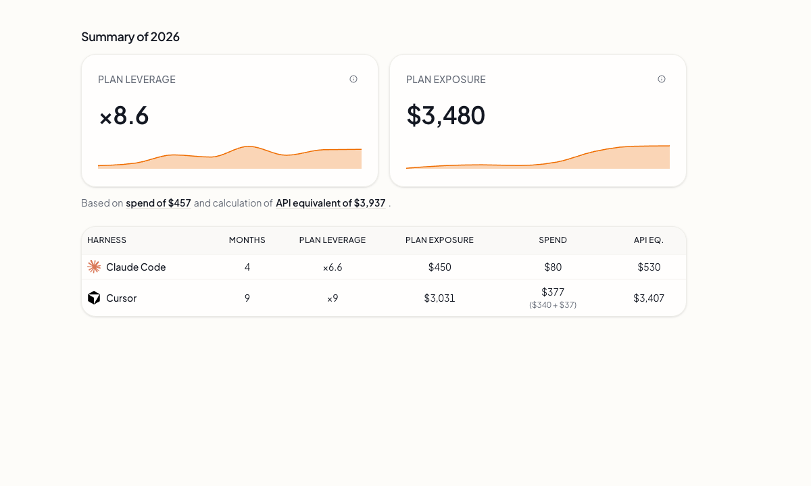
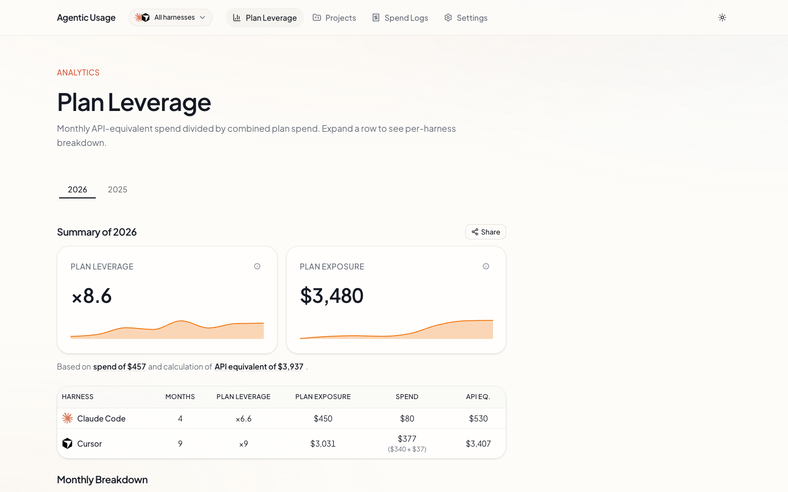
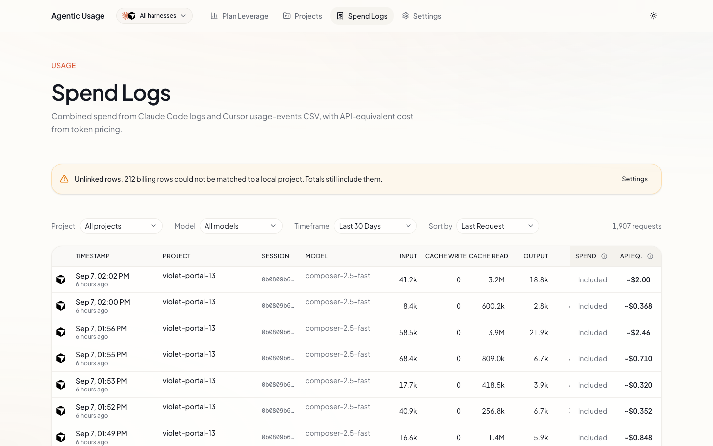
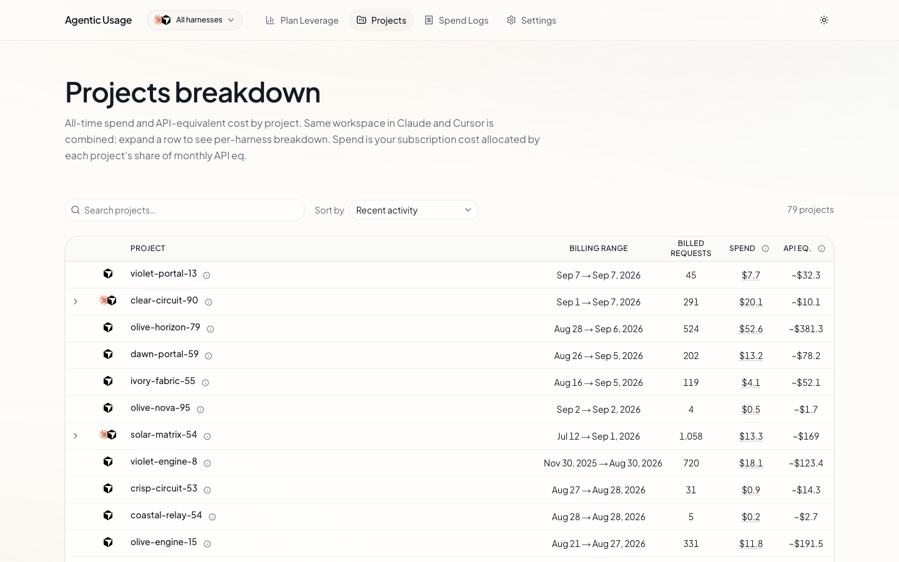

# Agentic Usage

**Local observability for your coding agent harnesses.** See spend, subscription leverage, and project breakdown — in one dashboard on your machine.



License: PolyForm Noncommercial · Local-only · No telemetry

---

## The 30-second version

Agentic Usage is a **local dashboard** that reads usage data from the coding agent tools you already run. It indexes session logs, imports billing exports where needed, and shows you **where the money went** — per request, per project, and per subscription month.

Everything stays on your machine. No accounts, no cloud sync, no outbound calls.

---

## What you get

| View | What it shows |
|------|----------------|
| **Spend Logs** | Per-request token spend with filters by project, model, and date |
| **Plan Leverage** | Monthly API-equivalent spend ÷ subscription price — are you getting your plan's worth? |
| **Projects** | All-time spend allocated by project/workspace across harnesses |
| **Settings** | Harness switch, plan overrides, billing CSV import, log re-index |

**Works today**

- Multiple coding agent harnesses in one app — switch in the navbar or merge into a combined view
- Automatic subscription plan detection where the harness exposes it
- Sparklines, year summaries, and shareable leverage snapshots

**On the roadmap**

- Codex and additional harness adapters
- One-line install (`curl … \| bash`) — dev install below for now

---

## Screenshots

### Plan Leverage

Monthly API-equivalent spend divided by subscription cost — with year summaries, per-harness breakdown, and shareable snapshots.



### Spend Logs

Per-request token spend with filters by project, model, and date range.



### Projects

All-time spend allocated by project/workspace, with per-harness drill-down.



---

## Install

**Requirements:** Node.js 20+ and at least one supported coding agent harness with local data on disk.

```bash
git clone https://github.com/eladdromy/agentic-usage.git
cd agentic-usage
npm install
npm run dev
```

Open [http://localhost:3000](http://localhost:3000) (redirects to Plan Leverage).

Auto-open the browser after start:

```bash
npm run dev:open
```

Production build:

```bash
npm run build
npm start
```

> **Coming soon:** a single install command so you don't need to clone and run dev manually. Track progress in [Issues](https://github.com/eladdromy/agentic-usage/issues).

---

## First run

1. Start the dev server (above).
2. Open **Settings** and confirm the active harness (or choose **All harnesses**).
3. For harnesses that use billing CSV exports, upload your **usage-events** CSV from the provider billing dashboard.
4. For harnesses that write session JSONL logs, click **Re-index** once — after that, indexing runs automatically on navigation.

Spend Logs populate as data is indexed or imported. Plan Leverage and Projects fill in once there is spend to analyze.

---

## Environment

| Variable | Default | Purpose |
|----------|---------|---------|
| `AGENTIC_USAGE_DATA_DIR` | `./.data` | SQLite index and app settings |
| `AGENTIC_USAGE_ANONYMIZE` | off | Replace project **display** names/paths in API responses (for README screenshots). Filter values stay real so Spend Logs project filters still work. |
| `CLAUDE_HOME` | `~/.claude` | Claude Code data directory |
| `VSCDB_PATH` | Cursor global `state.vscdb` | Override IDE state DB path |

When `AGENTIC_USAGE_ANONYMIZE=1`, only labels shown in the UI are anonymized — not internal filter keys or database queries.

---

## README screenshots

Regenerate demo images (builds a production server with anonymization, scans APIs and rendered pages for leaks, then captures four PNGs):

```bash
npm run screenshots
```

Use an existing dev server only if it was started with anonymization enabled:

```bash
AGENTIC_USAGE_ANONYMIZE=1 npm run dev
SCREENSHOT_USE_DEV=1 npm run screenshots
```

If the dev server is not anonymized, the script exits unless you pass `SCREENSHOT_FORCE_DEV=1` (not recommended).

Verify leak checks against a running server:

```bash
SCREENSHOT_BASE_URL=http://localhost:3001 npm run screenshots:verify
```

See [docs/readme-screenshots.md](./docs/readme-screenshots.md) for details.

## Privacy

- All data stays local — SQLite indexes and settings under `.data/`
- No authentication layer (localhost tool)
- No analytics or telemetry

---

## Docs

Detailed architecture, CSV import, log parsing, and plan pricing: [docs/README.md](./docs/README.md).

---

## Roadmap

- [ ] Codex harness adapter
- [ ] One-line installer script
- [x] README screenshots and demo assets
- [ ] Additional harnesses as their local data formats stabilize

Issues and PRs welcome once the repo is public.

---

## License

**PolyForm Noncommercial 1.0.0** — see [LICENSE](./LICENSE).

| Use case | Allowed? |
|----------|----------|
| Personal / hobby / research / education | Yes |
| Noncommercial organizations | Yes |
| Commercial use | Requires a separate license — [open an issue](https://github.com/eladdromy/agentic-usage/issues) |
