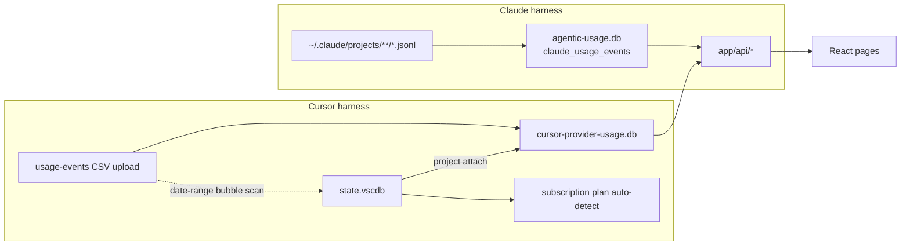
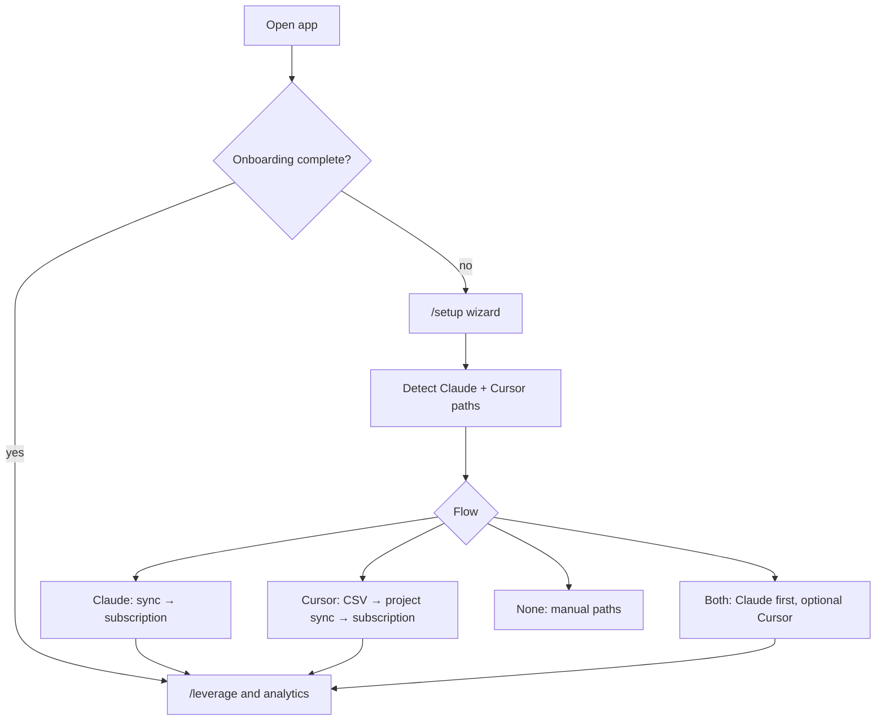

# Architecture

Agentic Usage is a **local Next.js app** that serves a browser UI for coding agent harness observability — spend logs, subscription leverage, and project breakdown. Supports multiple harnesses today (switch in the top navbar); designed to add more adapters over time. Research for Codex CLI and Grok Build (both local-log harnesses, unlike Cursor CSV): [future-harnesses-codex-grok.md](./future-harnesses-codex-grok.md).

## Data flow

## Components

| Layer | Technology |
|-------|------------|
| Framework | Next.js 16 App Router |
| UI | React 19, Tailwind 4, shadcn/ui, recharts, Plus Jakarta Sans, next-themes |
| Index | better-sqlite3 |
| Config | `~/.claude.json`, `.data/settings.json`, optional `VSCDB_PATH` |

## Harness selection

`activeHarness` in `.data/settings.json` (`claude` | `cursor` | `all`). When unset, auto-defaults to Cursor if only vscdb exists, else Claude. Switch in the top navbar; **All harnesses** merges Claude and Cursor rows on Spend Logs.

After onboarding, the navbar harness control is **dynamic**:

| State | UI |
|-------|-----|
| Only Claude installed / detected | Static badge "Claude Code" |
| Only Cursor with CSV imported | Static badge "Cursor" |
| Both (Claude home + Cursor CSV) | Dropdown: All / Claude / Cursor |

Availability after onboarding uses **install detection** (Claude home on disk, Cursor `state.vscdb`) so the All harnesses dropdown appears when both tools are present — even if only Claude has been set up. When Cursor is installed but billing CSV is not imported yet, a global setup banner appears at the top of every app screen (Plan Leverage, Projects, Spend Logs, Settings).

## First-run onboarding

New installs are gated at `/setup` until at least one harness has indexed/imported data **and** subscription details are approved. Detection uses fast filesystem checks only (no bubble reads). Existing installs with data in SQLite skip the wizard automatically.

Details: [onboarding.md](./onboarding.md).

## Sync

- **Claude** — JSONL mtime watermark; one row per assistant message with `message.usage`. Triggered on navigation and manual Re-index.
- **Cursor** — **no full log indexing**. Spend and leverage read uploaded **usage-events CSV** only. After CSV import, **scoped** reads of `state.vscdb` (user/agent bubbles in the billing date range) attach project paths; subscription plan still auto-detects from ItemTable profile keys.

## API routes

| Route | Method | Purpose |
|-------|--------|---------|
| `/api/raw-spend` | GET | Paginated spend rows (harness-aware) |
| `/api/projects-breakdown` | GET | Per-project all-time API eq + subscription spend (allocated by monthly API-eq share), first→last billed request range; merges same workspace across harnesses |
| `/api/leverage` | GET | Yearly/monthly leverage table rows + sparklines; supports **all harnesses** with expandable per-harness breakdown |
| `/api/profile` | GET | Paths, counts, harness, plan, harness availability |
| `/api/onboarding/status` | GET | Harness detection, readiness, suggested setup flow |
| `/api/onboarding/complete` | POST | Mark onboarding done and set `activeHarness` |
| `/api/settings` | GET/PUT | Plan overrides, harness, sync settings, onboarding flags |
| `/api/settings/plan-months` | GET | Months with usage + tier presets for subscription UI |
| `/api/sync` | POST | Re-index Claude JSONL (no-op for Cursor) |
| `/api/cursor/provider-usage/upload` | POST | Import billing CSV + project attach |
| `/api/cursor/attach-projects` | POST | Re-run project attach on stored CSV rows |
| `/api/cursor/billing-coverage` | GET | CSV date range, export links, unmatched preview |
| `/api/cursor/local-export-suggestion` | GET | Pre-upload dashboard export link from local vscdb composer activity (`from` = first local day, `to` = today) |

Default route: `/` → `/leverage` (Plan Leverage). Incomplete onboarding redirects to `/setup`.

## Security

All data stays on the local machine. No auth, no cloud, no outbound telemetry.

Optional `AGENTIC_USAGE_ANONYMIZE=1` replaces project display names in API responses for README screenshots; see [readme-screenshots.md](./readme-screenshots.md).

## Page loading

Every analytics page uses the same loading pattern:

1. **Static header** — `PageHeader` renders immediately (also in each route’s `Suspense` fallback) so the title and description never jump.
2. **Content skeleton** — shared layouts in `src/components/layout/page-loading-skeletons.tsx` mirror the final page structure (filters, tables, cards).
3. **Indexing** — Claude log sync shows a compact **Indexing…** spinner in the app header only; page bodies stay on skeletons until data is ready (no separate indexing card).

Initial load covers both route sync (`syncing`) and the first API fetch (`loading` while `data == null`).
