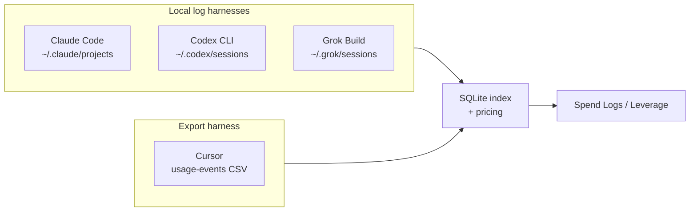

# Future harnesses: Codex CLI and Grok Build

**Scope:** Research notes for adding OpenAI Codex CLI and xAI Grok Build as harness adapters. **Not implemented** — reference for when integration is planned.

**Related docs:** [claude-log-parsing.md](./claude-log-parsing.md) · [cursor-provider-usage-csv.md](./cursor-provider-usage-csv.md) · [architecture.md](./architecture.md)

---

## Summary

Both Codex CLI and Grok Build are **local-log harnesses** (like Claude Code), not export-based harnesses (like Cursor).

| Harness | Data source | Token data in local logs? | Manual export required? |
|---------|-------------|---------------------------|-------------------------|
| Claude Code | `~/.claude/projects/**/*.jsonl` | Yes — per `assistant` message | No |
| **Codex CLI** | `~/.codex/sessions/**/*.jsonl` | Yes — cumulative `token_count` events | No |
| **Grok Build** | `~/.grok/sessions/**/updates.jsonl` | Yes — `turn_completed.usage` (newer builds) | No |
| Cursor | Billing CSV upload | Yes — but only after dashboard export | **Yes** |

Neither Codex nor Grok requires a Cursor-style billing CSV export to calculate tokens and cost. Both write session transcripts locally that community tools already parse.

---

## Codex CLI

### Local paths

| Path | Purpose |
|------|---------|
| `~/.codex/sessions/YYYY/MM/DD/rollout-*.jsonl` | One JSONL file per session (primary source) |
| `~/.codex/archived_sessions/rollout-*.jsonl` | Sessions archived from the Codex UI |
| `~/.codex/auth.json` | Auth token (for optional live rate-limit / credits API) |
| `~/.codex/log/codex-tui.log` | Runtime diagnostics (not needed for usage) |

Override home with `CODEX_HOME` (comma-separated list supported by ccusage).

### JSONL format

Each line is `{ "timestamp", "type", "payload" }`. Relevant event types:

| `type` | Purpose |
|--------|---------|
| `session_meta` | Session identity, CLI version |
| `turn_context` | Active model for the upcoming turn |
| `event_msg` | Token counts, task lifecycle, agent reasoning |
| `response_item` | Messages, tool calls, tool outputs |

Token usage lives in `event_msg` where `payload.type === "token_count"`:

```json
{
  "type": "event_msg",
  "payload": {
    "type": "token_count",
    "info": {
      "total_token_usage": {
        "input_tokens": 18193,
        "cached_input_tokens": 10624,
        "output_tokens": 371,
        "reasoning_output_tokens": 38,
        "total_tokens": 18564
      }
    }
  }
}
```

### Parsing notes

- Totals are **cumulative per session** — compute per-turn deltas by subtracting the previous `total_token_usage` from the current one.
- Prefer `info.total_token_usage`; fall back to `info.last_token_usage` when cumulative is absent.
- Model id comes from `turn_context` events in the same rollout file.
- Deduplicate repeated snapshots that repeat the same cumulative total with a different timestamp.

### Token field mapping (proposed)

| Plan Leverage column | Codex JSONL field |
|----------------------|-----------------|
| Input (fresh) | `input_tokens − cached_input_tokens` |
| Cache read | `cached_input_tokens` |
| Output | `output_tokens` |
| Reasoning | `reasoning_output_tokens` (subset of output — do not double-add) |

### Caveats

- Token logging started **2025-09-06** ([Codex commit 0269096](https://github.com/openai/codex/commit/0269096229e8c8bd95185173706807dc10838c7a)). Older session files have no usage metrics.
- Some Sept 2025 builds emitted `token_count` without matching `turn_context` model metadata — skip or flag those events to avoid mispriced rows.
- Multi-agent / subagent rollouts may replay parent history; baseline from inherited snapshot before counting child deltas (see ccusage Codex guide).
- Optional live data: authenticated ChatGPT usage endpoint and `codex app-server` `account/rateLimits/read` for plan/credits — supplementary, not a substitute for local JSONL.

### Reference tools

- [ccusage Codex guide](https://ccusage.com/guide/codex/) — `npx @ccusage/codex@latest`
- [OpenUsage Codex provider](https://openusage.sh/docs/providers/codex/) — reads `~/.codex` for tokens, models, rate limits
- [codex-trace](https://github.com/plentycoups/codex-trace) — session viewer for `~/.codex/sessions`

### Suggested implementation shape (Claude-like)

```
~/.codex/sessions/**/*.jsonl
  → discovery (walk + mtime watermarks)
  → parse token_count deltas + turn_context model
  → index into codex_usage_events (new table)
  → reuse existing pricing in src/lib/pricing/model-pricing.ts
```

Project attribution: derive from session cwd if present in `session_meta` / rollout metadata (verify against live Codex builds).

---

## Grok Build

### Local paths

| Path | Purpose |
|------|---------|
| `~/.grok/sessions/<url-encoded-cwd>/<session-uuid>/updates.jsonl` | ACP update stream — **primary usage source** |
| `~/.grok/sessions/.../summary.json` | Session id, cwd, timestamps, `current_model_id` |
| `~/.grok/sessions/.../events.jsonl` | Turns, tool calls, phase changes |
| `~/.grok/sessions/.../signals.json` | `modelsUsed`, `toolsUsed`, `contextTokensUsed` |
| `~/.grok/sessions/.../chat_history.jsonl` | Chat history (not needed for billing) |

Override home with `GROK_HOME` or `--grok-dir`.

### Authoritative usage (`turn_completed`)

Newer Grok Build versions write a durable usage record when each prompt completes:

```json
{
  "sessionUpdate": "turn_completed",
  "prompt_id": "…",
  "stop_reason": "end_turn",
  "usage": {
    "inputTokens": 19762,
    "outputTokens": 36,
    "totalTokens": 19798,
    "cachedReadTokens": 5376,
    "reasoningTokens": 31,
    "modelCalls": 1,
    "apiDurationMs": 2188,
    "costUsdTicks": 306008000,
    "modelUsage": {
      "grok-4.5-build": { "inputTokens": 19762, "outputTokens": 36, "…": "…" }
    }
  }
}
```

Wire format uses snake_case (`prompt_id`, `session_update`) in some builds; handle both conventions.

### Token field mapping (proposed)

Convention matches Codex / Claude: `inputTokens` **includes** cached reads.

| Plan Leverage column | Grok `usage` field |
|----------------------|--------------------|
| Input (fresh) | `inputTokens − cachedReadTokens` |
| Cache read | `cachedReadTokens` |
| Output | `outputTokens` |
| Reasoning | `reasoningTokens` (subset of output — do not double-add) |
| Reported cost (optional) | `costUsdTicks / 1e9` USD (observational; verify scale) |

Total tokens: `(input − cached_read) + output + cached_read` (equivalently `inputTokens + outputTokens − cachedReadTokens` when reasoning is already in output).

### Legacy fallback (pre-`turn_completed`)

Older sessions only logged `_meta.totalTokens` on streamed chunks — a **running context fill**, not billable input/output. Estimating from the per-turn context curve can undercount by an order of magnitude on long sessions ([TokenBar #77](https://github.com/Nanako0129/TokenBar/pull/77)).

**Recommendation:** Use `turn_completed.usage` as the authoritative path. Fall back to context-curve estimation only for older logs, and mark those rows `costIsEstimated` (same pattern as Cursor `~` prefix).

### Parsing notes

- Only completed turns have usage — in-progress turns and sessions killed mid-turn contribute no tokens.
- Deduplicate by `prompt_id` across session forks (forks copy `updates.jsonl` with rewritten timestamps but preserved `prompt_id`).
- `modelUsage` provides per-model splits when subagents use different models; decide whether to attribute one row per model or one row per turn.
- `logs/unified.jsonl` lacks per-request model id — do not use as a billing source ([ccusage Grok guide](https://ccusage.com/guide/grok/)).
- Grok CLI `/usage` command hits a **backend subscription API** — not a local ledger. Local `turn_completed` records are the forensic source.

### Caveats

- Subscription (SuperGrok) vs metered API: session files do not record which billing mode was active — cost is API-equivalent unless `costUsdTicks` is trusted.
- Cache write tokens: not always exposed separately; treat as input subset when absent.
- Tool-call fees (web search, etc.) are not in local logs.
- Optional: [grokscope](https://github.com/daniel-farina/grokscope) reverse proxy (`base_url = http://127.0.0.1:18080/v1`) captures per-API-call I/O for finer granularity — only if needed beyond `turn_completed`.

### Reference tools

- [ccusage Grok guide](https://ccusage.com/guide/grok/)
- [g3usage](https://github.com/GhaythBenAbid/G3usage) — Grok-specific daily/session reports (context-curve era)
- [grokscope](https://github.com/daniel-farina/grokscope) — dashboard + optional API tap

### Suggested implementation shape (Claude-like)

```
~/.grok/sessions/**/updates.jsonl
  → discovery (walk session dirs + read summary.json for cwd)
  → parse turn_completed.usage (primary) or context-curve estimate (legacy)
  → dedupe by prompt_id
  → index into grok_usage_events (new table)
  → project = summary.json cwd
```

---

## Comparison to existing harnesses



| Concern | Claude (today) | Codex (future) | Grok (future) | Cursor (today) |
|---------|----------------|----------------|---------------|----------------|
| Sync trigger | File watcher / manual reindex | Same pattern | Same pattern | CSV upload |
| Granularity | Per assistant message | Per token_count delta | Per turn_completed | Per billed LLM call |
| Project path | Slug → `~/.claude.json` | Session cwd in metadata | `summary.json` cwd | vscdb bubble match post-upload |
| On-demand vs included | `costUSD` in log | Pricing table estimate | `costUsdTicks` or estimate | CSV `Kind` + `Cost` |
| Reset script | `npm run reset:claude` | TBD | TBD | `npm run reset:cursor` |

---

## Open questions before implementation

1. **Harness switch UI** — extend `activeHarness` enum (`claude | cursor | codex | grok | all`) and install detection (check `~/.codex`, `~/.grok` dirs).
2. **Unified schema** — map Codex/Grok rows into the same spend-log shape as Claude, or separate tables with a merge layer (current Claude/Cursor pattern).
3. **Codex in Cursor IDE** — Codex sessions inside Cursor may still write to `~/.codex/sessions`; confirm whether IDE-embedded runs share the same JSONL format as CLI.
4. **Grok legacy sessions** — ship without context-curve fallback initially, or include with clear `~` estimated flag?
5. **Subscription plans** — Codex (ChatGPT/Codex plan) and Grok (SuperGrok) plan detection likely needs API/auth reads, not local logs alone.

---

## External references

- Codex session forensics: [Codex Knowledge Base — JSONL post-mortems](https://codex.danielvaughan.com/2026/06/05/codex-cli-session-forensics-jsonl-post-mortems-codex-trace-cass-ccusage/)
- Grok ACP wire format: [grok-build-unofficial acp-findings](https://github.com/sr-web-studio/grok-build-unofficial/blob/main/docs/acp-findings.md)
- TokenBar Grok fix (turn_completed vs context counters): [PR #77](https://github.com/Nanako0129/TokenBar/pull/77)
